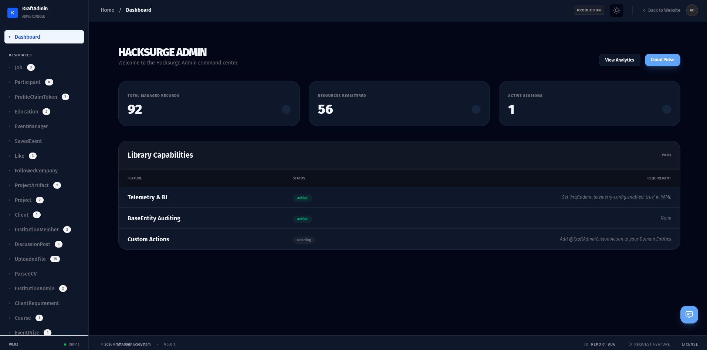
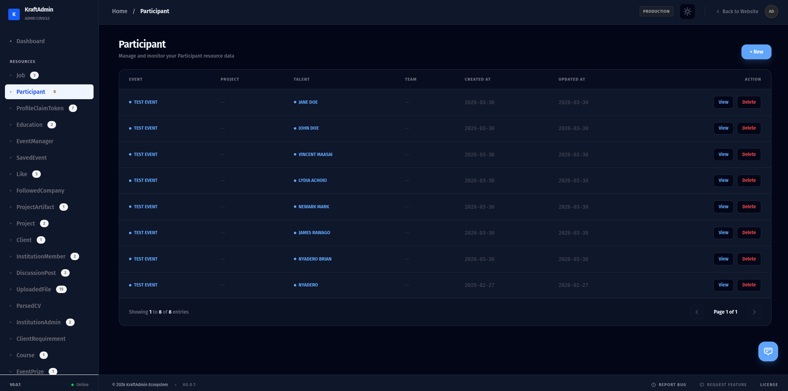
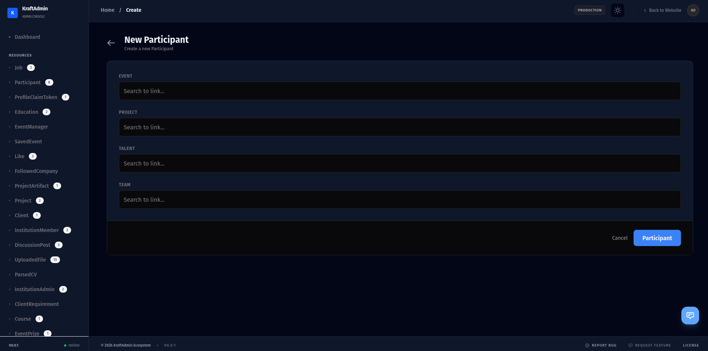
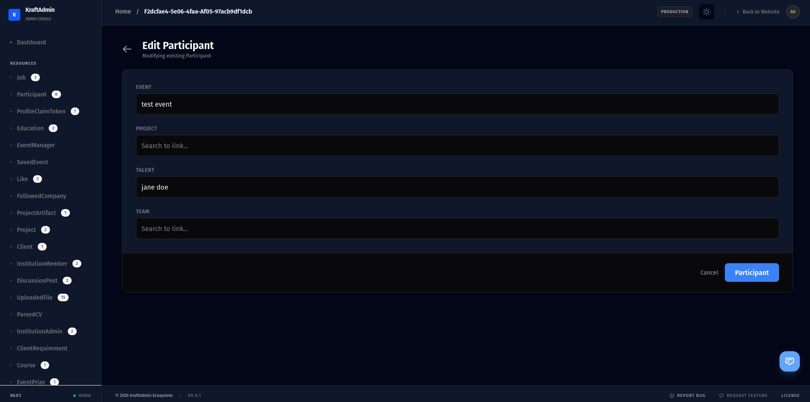
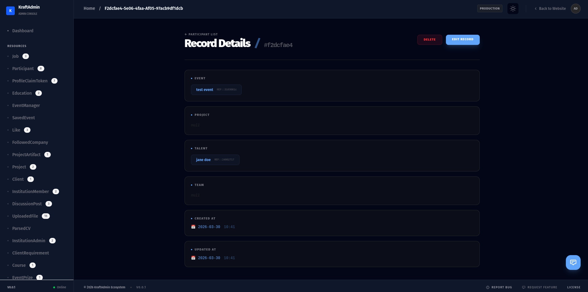

# KraftAdmin

## Important Notice

**KraftAdmin** is currently in **beta** and **not yet stable for production use**. Use it for experimentation, internal testing, or learning purposes only.

---

## Overview

**KraftAdmin** is a high-performance, developer-first administration and telemetry engine designed for the **Spring Boot ecosystem (Java/Kotlin)**.

It acts as a **plug-and-play metadata processor** that inspects your domain models (`@Entity` / R2DBC entities) and automatically generates a sophisticated, reactive management dashboard — with **no frontend development required**.

At its core, KraftAdmin shifts the burden of building internal tools from manual UI coding to **declarative configuration via annotations**, making your admin dashboards consistent, reactive, and fast to set up.

## Quick Start

---

### Gradle (Kotlin DSL)

```kotlin
// build.gradle.kts
dependencies {
    implementation("com.bowerzlabs:kraft-admin:0.1.0-beta")
}
```

### Groovy

```groovy
// build.gradle
dependencies {
implementation 'com.bowerzlabs:kraft-admin:0.1.0-beta'
}
```

### Maven

```xml
<dependency>
    <groupId>com.bowerzlabs</groupId>
    <artifactId>kraft-admin</artifactId>
    <version>0.1.0-beta</version>
</dependency>
```

---

## What It Achieves (Current Capabilities)

- **Zero-Config UI Generation**  
  By scanning your `@Entity` classes, it builds full CRUD (Create, Read, Update, Delete) interfaces instantly.

- **Unified Reactive/Blocking Support**  
  Works seamlessly with both traditional Spring Data JPA and modern R2DBC/WebFlux reactive stack.

- **Smart Field Inference**  
  Through the reflection, maps Java types and JPA annotations to advanced UI components like:
    - WYSIWYG editors
    - Image uploaders
    - Searchable relationship pickers

- **Application-Wide Telemetry**  
  Provides a centralized system for analytics, enabling real-time observation of:
    - Record changes
    - System health

- **Audit Integration**  
  Native support for `BaseEntity` auditing — tracking **who changed what and when** at the database level.

---

## 🛠️ Features: Current vs Planned

| Feature Category | Current (Beta) | Planned (Roadmap) |
|-----------------|----------------|------------------|
| **Framework Support** | Spring Boot (Java/Kotlin) | Ktor, Micronaut, Quarkus adapters |
| **Data Handling** | Dynamic filtering, sorting, global search | Multi-tenant data isolation |
| **UI/UX** | Dark-mode Svelte SPA, vertical record stacks | Custom theme engine & white-labeling |
| **Field Types** | 20+ supported types (JSON, Media, Enums) | Drag-and-drop file orchestration |
| **Compliance** | Basic `BaseEntity` auditing | Advanced local compliance & audit tools |
| **Extension** | Custom `@FormInputType` annotations | Plugin system for dashboard widgets |

---

## ⚙️ Configuration

KraftAdmin can be configured using either **`application.properties`** or **`application.yml`** depending on your Spring Boot setup.

---

### 📄 application.properties

```properties
## Enable the library

# 1. Root Level Settings
kraftadmin.base-path=/admin
kraftadmin.title=KraftAdmin Dashboard
kraftadmin.logo-url=https://example.com/logo.png

# 2. Theme Settings
kraftadmin.theme.primary-color=#3b82f6
kraftadmin.theme.dark-mode=true

# 3. Storage Settings
kraftadmin.storage.upload-dir=uploads/admin
kraftadmin.storage.public-url-prefix=/admin/files

# 4. Security Settings
kraftadmin.security.session-expiry-minutes=120
kraftadmin.security.cookie-name=KRAFTADMIN_SESSION

# Required Roles
kraftadmin.security.required-roles[0]=ROLE_ADMIN
kraftadmin.security.required-roles[1]=ROLE_MANAGER
kraftadmin.security.required-roles[2]=ROLE_USER

# Protected Routes (Map)
kraftadmin.security.protected-routes[/api/users/**]=ROLE_ADMIN
kraftadmin.security.protected-routes[/api/settings/**]=ROLE_ADMIN

# Basic Auth Fallback (USE ENV VARIABLES IN PRODUCTION)
kraftadmin.security.basic-auth.username=admin@example.com
kraftadmin.security.basic-auth.password=change-me

# 5. Pagination Settings
kraftadmin.pagination.default-page-size=20
kraftadmin.pagination.max-page-size=100

# 6. Feature Toggles
kraftadmin.features.allow-delete=true
kraftadmin.features.show-timestamps=true
kraftadmin.features.read-only=false

# 7. Locale & Timezone
kraftadmin.locale-config.default-language=en
kraftadmin.locale-config.timezone=UTC

# 8. Telemetry (The 0.1.0 BI Heartbeat)
kraftadmin.telemetry-config.cloud-url=http://localhost:8080
kraftadmin.telemetry-config.enabled=true

```

### 📄 application.yml

```yaml
kraftadmin:
  base-path: /admin
  title: "KraftAdmin Dashboard"
  logo-url: "https://example.com/logo.png"

  theme:
    primary-color: "#3b82f6"
    dark-mode: true

  storage:
    upload-dir: "uploads/admin"
    public-url-prefix: "/admin/files"

  security:
    session-expiry-minutes: 120
    cookie-name: "KRAFTADMIN_SESSION"

    required-roles:
      - ROLE_ADMIN
      - ROLE_MANAGER
      - ROLE_USER

    protected-routes:
      "/api/users/**": ["ROLE_ADMIN"]
      "/api/settings/**": ["ROLE_ADMIN"]

    basic-auth:
      username: "admin@example.com"
      password: "change-me"

  pagination:
    default-page-size: 20
    max-page-size: 100

  features:
    allow-delete: true
    show-timestamps: true
    read-only: false

  locale-config:
    default-language: "en"
    timezone: "UTC"

  telemetry-config:
    cloud-url: "http://localhost:8080"
    enabled: true
```

## What It Does vs Does Not Do

### What It Does

- **Massive Time Savings**  
  Eliminates the need to build custom admin panels for every project.

- **Consistency**  
  Enforces uniform UI/UX patterns and security across all entities.

- **Performance**  
  Uses a **fat module architecture** to reduce dependency conflicts and optimize JVM runtime performance.

- **Verification**  
  Published under the verified `com.bowerzlabs` namespace on Maven Central — ensuring enterprise-grade trust.

---

### What It Does NOT Do

- **End-User Storefronts**  
  Not a website builder for customers — it is strictly an internal tool.

- **Generic Database Management**  
  Unlike tools like DBeaver or pgAdmin, it requires a Spring Boot context — it is a library, not a standalone client.

- **Low-Code for Non-Developers**  
  Requires developers to annotate Java/Kotlin classes — not designed for non-technical users.

- **Heavyweight CMS Replacement**  
  Not a replacement for platforms like WordPress or Contentful — focused on data management and telemetry, not content publishing.

## KraftAdmin Screenshots

### Compact Table View

|  <br> **Dashboard Overview** |  <br> **List View** |  <br> **Create View** |
|----------------|----------------|----------------|
| High-level overview of entities, telemetry, and system status. | Paginated records with filtering, search, and sorting options. | Form interface for adding new entities with smart field inference. |

|  <br> **Edit View** |  <br> **Details Page** |
|----------------|----------------|
| Modify existing entity records with inline validation and dynamic input types. | Detailed view of a single entity, showing relationships, audit info, and metadata. |

---

